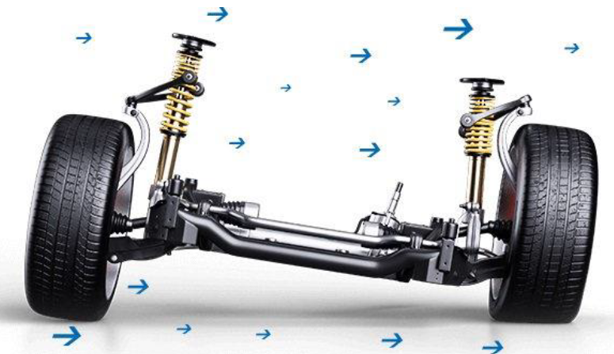
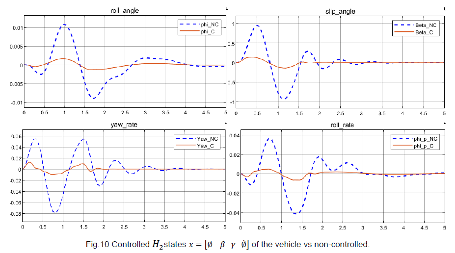

# Active-Steering-Control-Autonomous-driving

Code developed for "S. Sanchez, - DAMPING OF VEHICLE ROLL DYNAMICS BY ACTIVE STEERING CONTROL ".  
Master's graduate "Calabria University".  
For any questions or suggestions write to sofysan.1993@gmail.com

# Sumary.
The project titled "Damping Vehicle Roll Dynamics through Active Steering Control" aims to enhance vehicle stability and reduce lateral roll or body lean during driving maneuvers. This is achieved through a comprehensive analysis of the dynamic model governing the system and the study of its structural properties. Modeling is conducted in the MATLAB/Simulink environment.  
The project involves designing various optimal controls, including H2, H∞, L1, LQ, and multiobjective control H2/H∞. Robust control is implemented using a polytopic model to account for system uncertainties, and LPV control techniques are applied. A comparison between different controllers is also performed to evaluate their effectiveness.  
Overall, this project seeks to develop advanced control strategies to improve vehicle stability and safety during dynamic driving conditions.

  

# Process  
1.  The projec starts finding the mamtematial description of the model.
2.	The dynamic system is build using Matlab/Simulink.
3.	Study of Structural Properties. 
4.	Desing the Optimal controls
5.	Desing Robust control

# Prerequisites
- The code was created and tested on the Matlab/Simulink 2023a environment

# File description
The repository contains three files to run the project.  

1. **Report_project**: This contains the explanation of the complete process, the mathematical formulations, and the control configuration.

2. **Code**: This file contains all the necessary MATLAB/Simulink programs

# Example to run the experiment  

### Matlab/Simulink simulation 
1. Download the files.
2. Run the matlab program **CONTROL_ROLL_OVER**
3. Select the controler

  

